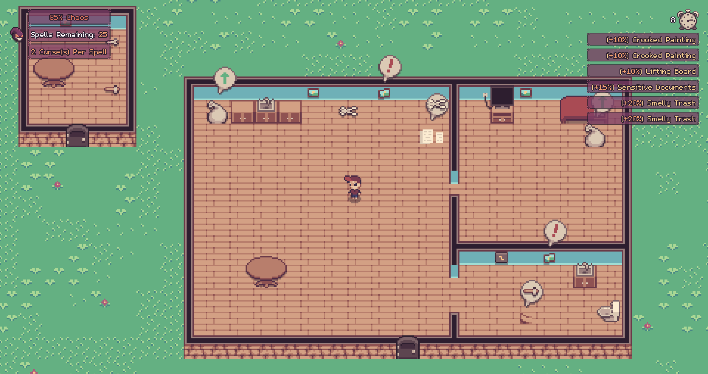

# The Curse of Household Chaos

A chaos wizard has put a curse on you.  Your household items are thrown into chaos every 10 seconds. Maintain your house through 30 rounds of chaos until the curse wears off.

How to play
-----------

Move: Arrow Keys or WASD
Interact: Z or Space Bar or E

- Interact with objects in chaos to restore them to normal.
- Some objects require a tool. Look around for the tools first.
- If trash piles up, take it out front to the trashcan.